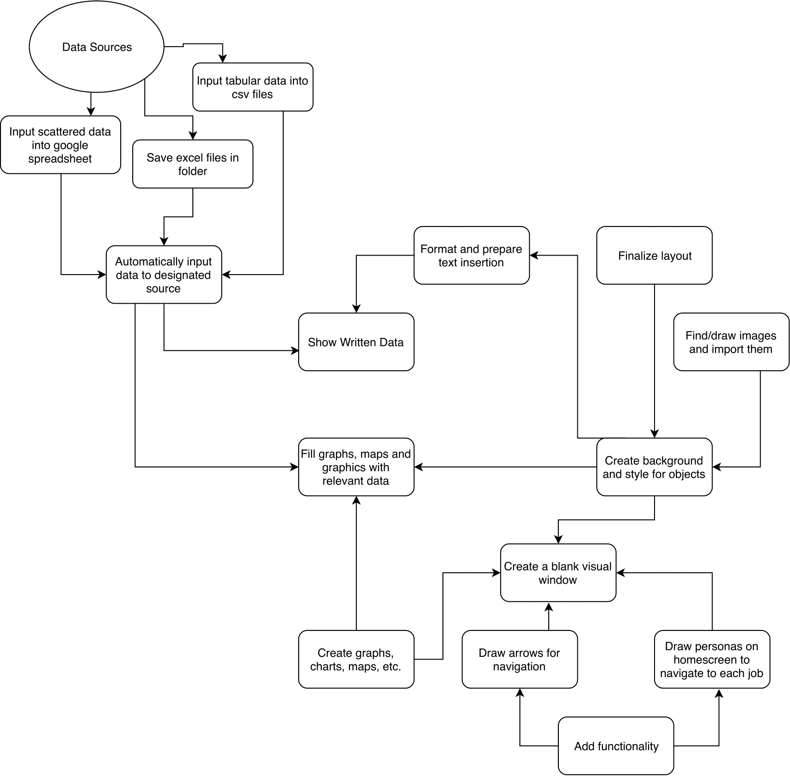

# About Our Code

## Overview
We are extracting online data, placing it into graphs using Matplotlib and creating a graphic user interface with Pygame.

The nuances of this operation are captured in our system architecture diagram:

### Collecting Data
We're collecting data from a variety of sources, including:
-U.S. Bureau of Labor Statistics
-U.S. Bureau of Labor

From these websites, we're pulling either csv files, excel files or pdf files. In the case of pdf files, we are converting them to csv files via Tabula.
From there, we are using Pandas to search the datasheets for specific values. We are creating functions that will easily find the correct data for the implementation of the graphs.

### Creating Graphs
Using the data collected in csv format, we produced different graphs to visualize different types of data.
First, we represented annual income with a stack of "dollar bills" (green parallelograms), where each sheet represents $10000.
To represent the ideal daily schedule of people, we used pie chart where each piece measures either the free time, work time, or sleep time.
To display the population of people holding the particular job in the U.S., we used a circle diagram, where the sizes of the two circles portray the ratio of the population holding particular job to the entire U.S. adult population.
To display the suicide rate of people holding the job, we will use a bar graph which compares the average suicide rate with the suicide rate of people with specific occupation.
(state population explanation tbd)

### Creating an Interface
