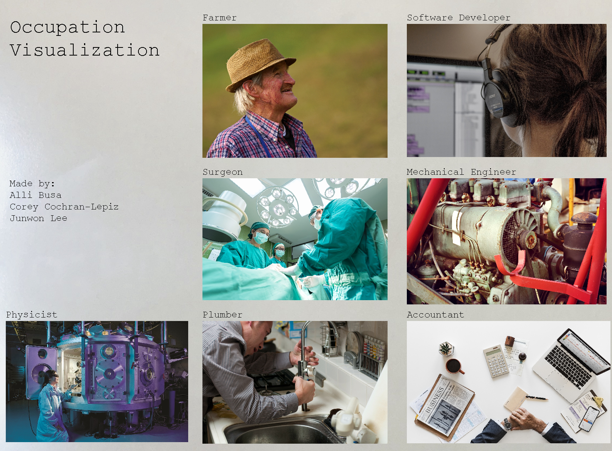

# About Our Code

## Overview
We are extracting online data, placing it into graphs using Matplotlib and creating a graphic user interface with Pygame.

The nuances of this operation are captured in our system architecture diagram:


### Collecting Data
We're collecting data from a variety of sources, including:
- U.S. Bureau of Labor Statistics
- U.S. Bureau of Labor
- Center for Disease Control and Prevention

For a complete list of sources, see [sources](Sources.md)

From these websites, we're pulling either csv files, excel files or pdf files. In the case of pdf files, we are converting them to csv files via Tabula.
From there, we are using Pandas to import the datasheets to dataframes. Ex:
```
gender = pd.read_csv('files/tabula-gender.csv')
gender_df = pd.DataFrame(gender)
```
We are creating functions that will easily find the correct data for the implementation of the graphs. One cell can be extracted using:
```
def get_specfic_value(database, profession, datatype):
    """This works for OES data, divorce rate, suicide rate, gender ratio, spending
    *note : for divorce rate, the profession for mech e is "mechanical engineer"
            also for divorce rate, the profession for software is "software developer"
    *note 2: the same applies for race. Also, the physicist data doesn't exist and
    the columns for the race data are : White, Black or African American,
    Asian, Hispanic or Latino

    """
    #formatting
    datatype = datatype.lower()
    database.columns = database.columns.str.lower()
    database = database.apply(lambda x: x.astype(str).str.lower())

    #finding the column and its index
    colNames = database.columns[database.columns.str.contains(pat = str(datatype))]
    column = colNames[0]
    colindex = database.columns.get_loc(column)
    #finding row index
    row, row_index = get_right_row(database, profession)
    #getting ouput
    output = database.iloc[int(row_index),int(colindex)]

    return output

```

### Creating Graphs
Using the data collected in csv format, we produced different graphs to visualize different types of data.

The graphs are produced using the collected data. To make the process easier, the functions are designed such that the users simply type the job title into the function.

For instance, the income diagram, which represents annual income with a stack of "dollar bills", takes the job title and creates a graph.

```
def create_income(job):
    """
    This function creates a diagram that represents income using stack
    of "paper bills", which are green parallelograms. Each bill represents
    $10000.
    """
    fig = plt.figure()
    ax = fig.add_subplot(111, aspect='equal')
    income = int(dt.get_specfic_value(OES_df, job, 'annual mean wage')) // 10000
    for i in range(0,income):
        x = [0.2,0.7,.8,.3]
        y = [0.15 + i*0.05,0.15+i*0.05,0.25+i*0.05,0.25+i*0.05]
        ax.add_patch(patches.Polygon(xy=list(zip(x,y)), fill=True, edgecolor = (0, 0, 0), facecolor = 'green'))
        ax.set_xticks([])
        ax.set_yticks([])
    ax.set_xlabel('Income (1 sheet = $10000)')
    ax.set_title('Annual Income')
    plt.show()
    fig.savefig('income.png', transparent = True)

```
As a result, this function generates graphs like this.


On the other hand, the schedule diagram, which shows the percentage of people with particular occupation at work in specific hour frame, simply asks for the string of job title. The function will then find the appropriate Pandas Series for the job, and create a bar graphs that shows the percentage of people at work in particular hour.
```
def create_worktime(job):
    """
    This function creates a histogram that shows the percentage of workers
    working throughout the 24 hour period.
    """
    work_time = dt.get_time_row(timework_df, job)
    fig, ax = plt.subplots()
    time_list = work_time[0].index.tolist() + work_time[1].index.tolist()
    percent_list = work_time[0].tolist() + work_time[1].tolist()
    percent_list = [x for x in percent_list if "plumber" not in x]
    time_list = [x for x in time_list if "occupation" not in x]
    percent_list = list(map(float, percent_list))
    for i in range(12, 24):
        string = time_list[i]
        if i == 12:
            string = str(i) + ' pm'
        else:
            string = str(i-12) + ' pm'
        time_list[i] = string
    y_pos = np.arange(len(time_list))
    bar = plt.bar(y_pos, percent_list, align='center', alpha=0.5)
    plt.xticks(y_pos, time_list, rotation = 'vertical')
    plt.ylabel('Percent of People at Work')
    plt.title('When do they work?')
    plt.show()
    fig.savefig('time.png', transparent = True)
```

As a result of this function, the graph below is created.


Other graphs also simply require the input of job title.

Once all the graph-generating functions are created, we created a single function create_graphs that produces all the graphs at once. Once again, it only requires the job title.
```
def create_graphs(job):
    """
    This function generates all the necessary graphs at once. You simply type
    the occupation name.
    """
    create_population(job)
    create_income(job)
    compare_suicide(job)
    get_gender(job)
    get_race(job)
    create_worktime(job)
    create_map(job)
```
Note that create_map function will create a window which shows the graph, but it won't save it in png format. To save the image, there is a save button on the left side of the graph. Click that button, and save the image into png format. This is much easier than installing multiple packages. 
### Creating an Interface
Using Pygame as a platform for the interface of the visualization seemed like the best route to go considering our previous exprience with it as well as the not-so-bright reviews about other means of creating an interactive interface. The process has been pretty straightforward in terms of coding the infrastructure for it. It currrently remains as a click-based interface.

We aimed for a simplistic aethetic for the project.

Some example code for our Screen class that made the UI possible:

```
class Screen():
    """ This is the basis for the entire UI
    Each 'screen' is saved as this object that contains all of the
    photos that appear as well as some helpful functions to render text
    as weel as a zoom in function that the main while loop helps manage.
    """
    black = (0,0,0)
    white = (255,255,255)
    bx = 700
    by = 100
    font = py.font.SysFont("couriernew",25) #for regular text
    title = py.font.SysFont("couriernew",50) #for title text
    bg = py.image.load('FinalFigures/Wb-5.jpg') #for background
    w,h = bg.get_size()
    bg = py.transform.scale(bg,(int(w*.7),int(h*.7))) #scaling for grey button that sometimes appears
    listOfNames  = ['Farmer','Software Developer','Surgeon','Mechanical Engineer',
                    'Physicist','Plumber','Accountant'] #unhealthy hardcode but neccesary
    z = False #zoom boolean

    def __init__(self,gD,name):
        """
        gD: gameDisplay for pygame
        name: name of screen (string)
        figures: list of figures (pygame img)
        locs: list of location (tuple)
        clickbox: list of clickbox blits (pygame rectangle)
        """
        self.gD = gD
        self.name = name
        self.figures = []
        self.locs = []
        self.clickbox = []


        button = py.image.load('FinalFigures/arrow.png')
        scale = .1
        lx,ly = 20,20
        # lx,ly = 1400,1000
        w,h = button.get_size()
        button = py.transform.scale(button,(int(w*scale),int(h*scale)))

        self.figures.append(button)
        self.locs.append((lx,ly))
        self.clickbox.append(gameDisplay.blit(button,(lx,ly)))
```


Go Back to the [Index](index.md)
