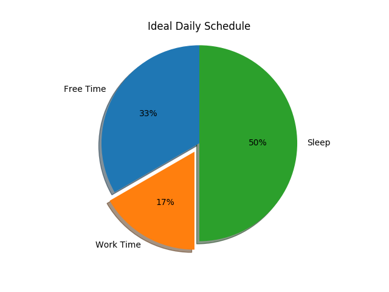

# Occupation Visualization - Software Design Project Spring 2018

This is a data visualization project concerning occupations in the United States. This project was created for the Software Design class at Olin College of Engineering.

Find out [about Our Code](./AboutOurCode.md) | Instructions at [Readme](./README.md)| About our [Project Evolution](./projectevolution.md)

## Our Goal

While brainstorming ideas for this assignment, we began talking about how cool seeing different types of data can be. Why? Visualizing data can show you what something in the world is like more comprehensively and accurately than your personal experiences can.
We decided to leverage this power of data visualization to show interested U.S. adults like ourselves what having a job in the U.S. is like for multiple occupations.
We aim to answer the questions:
- Are there any glaring disparities between types of occupations?
- Is there anything we can tell about how a person's way of life differs by occupation factors like location or free time?

## Our Intermediate Results

Right now, we have graphs that represent our data, like this one: 

More Graphs can be found in the [about our code section](./AboutOurCode.md)

We also have a User Interface that takes the graphs we have, and presents them to the user via Pygame:

