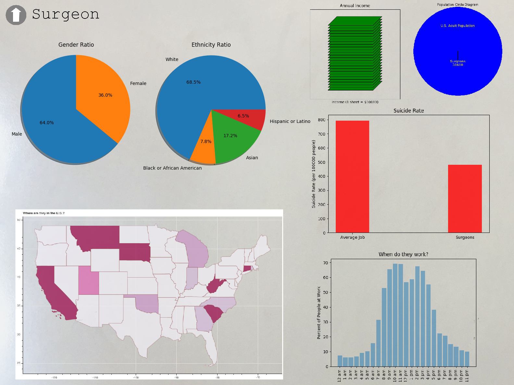

# Occupation Visualization - Software Design Project Spring 2018

This is a data visualization project concerning occupations in the United States. This project was created for the Software Design class at Olin College of Engineering.

Find out [about Our Code](./AboutOurCode.md) | Instructions at [Readme](./README.md)| About our [Project Evolution](./projectevolution.md) | Sources at [Sources](./Sources.md)

## Our Goal

Ever wonder how cool seeing different types of data can be? Visualizing data can show you what something in the world is like more comprehensively and accurately than your personal experiences can. 
We did too! Through our endevours we aim to answer these questions:

- Are there any glaring disparities between types of occupations?
- Is there anything we can tell about how a person's way of life differs by occupation factors like location?

## Our Final Results

[Link to Video](https://vimeo.com/268615482)

Our User Interface opens to a home page with pictures of the different professions

The user can select a profession and see the graphs we've generated for it.

### What Our Results Tell Us:

In all, a few aspects of our results gave us some unexpected insights into the lives of different professionals, but we wished that we had more. 

For one, our hypothesis going in was disproven. We thought that there would be a correlation between high suicide rate and low income, signaling lower happiness levels for low income professionals. However, what we found was that there wasn't a direct correlation. Farmers, who make the least amount of money, have the second lowest suicide rate. Furthermore, plumbers have the highest suicide rate of all our mapped professions. We couldn't find a correlation between suicide rate and any other factor we searched for- therefore, we think that happiness factor has to do with some data that is more complex and outside the data range that we had. 

Plumber did show however the lowest percentage of women- even lower than the other shown STEM fields. This visualizations underscores the gender divide in a profession that's usually not advicated for. 

Another part of professionals' lives that we can glean from the maps is that people who work high paying jobs usually live in urban areas. That means highly-paid professionals will be living in apartments while people like farmers live in houses. The heat maps are also telling of where "hotspots" in a professional field are. For example, the software developers' map shows that there are a lot of software developers in Washington and Microsoft is situated in Washington.

In the future, we hope to have more data that can more accurate portray the complexity of an individual's life.
